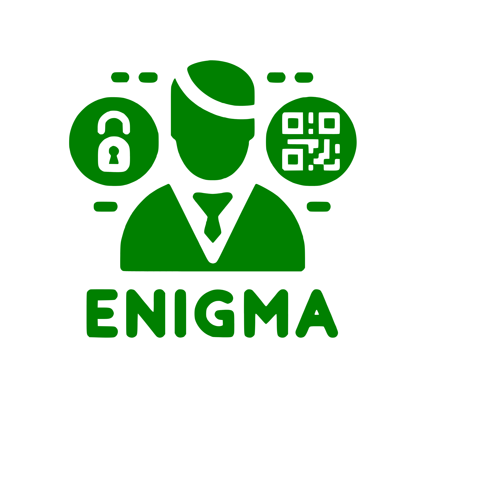

<p align="center">
  <a href="https://github.com/Julgodis/enigma/">
    <picture>
      
    </picture>
    <h1 align="center">
      Enigma
    </h1>
  </a>
</p>

<div align="center">
[](https://github.com/Julgodis/enigma/LICENSE)

```diff
!!! This project is primarily for personal use, and I may not actively accept !!!
!!! pull requests. Feel free to explore the code, but please understand that  !!!
!!! contributions might not be incorporated.                                  !!!
```

</div>

Enigma is an authentication service for user and session management:

* **User management** - Users can be authenticated with a username and password, or with a QR code. Users can be created, updated, and deleted.
* **Session management** - When a user is authenticated, a session is created. Sessions can be used to authenticate requests to other services. Sessions will expire after a period of inactivity.
* **Permission management** - Users can be assigned permissions, which can be used to restrict access to certain services.

## Getting Started

To get started with Enigma, you'll need to install Rust and Cargo. Once you have those installed, you can clone the Enigma repository and build the crates:

```sh
git clone https://github.com/Julgodis/enigma.git
cd enigma
cargo build --all
```

## Usage

Engima uses environment variables to configure the service. The following environment variables are required:
```sh
ENIGMA_LISTEN=127.0.0.1:3333
ENIGMA_DATABASE_PATH=enigma.sqlite
ENIGMA_PASSWORD_SALT=b64_encoded_salt
```
